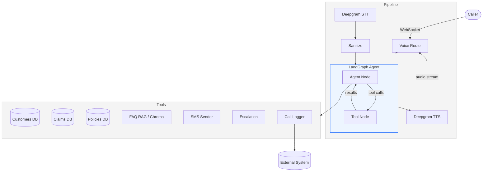

# Observe Insurance — AI Claims Support Agent

VoiceAI agent that handles inbound calls from customers checking on insurance claim status. Built for the Observe.AI AI Agent Engineer take-home assessment.

**Status:** Take-home assessment — not intended for production use.

## Quick Start

```bash
uv sync
cp .env.example .env   # fill in API keys
uv run python -m app.db.init_db   # seed database
uv run python -m app.rag.ingest   # build FAQ vector store
uv run uvicorn app.main:app --reload
```

Open `http://localhost:8000` for the web voice demo.

## Architecture



### Call Flow

1. **Authenticate** — caller provides phone number, agent verifies against customer DB
2. **Handle request** — retrieve claim status, answer FAQs, or escalate
3. **Respond** — agent generates response, TTS streams audio back
4. **Log** — post-call record (summary, sentiment, duration) written to external system

## Integrations

| Service | Purpose |
|---------|---------|
| **Deepgram** | Speech-to-text and text-to-speech |
| **OpenRouter** | LLM orchestration (multi-provider) |
| **Chroma** | Vector store for FAQ retrieval (RAG) |
| **SQLite + SQLAlchemy** | Customer, claim, and policy data |
| **LangGraph** | Agent workflow and state management |

## Agent Tools

| Tool | Description |
|------|-------------|
| `customers` | Look up customer by phone number |
| `claims` | Retrieve claim status and details |
| `policies` | Fetch policy information |
| `faq` | RAG-based FAQ retrieval from knowledge base |
| `sms` | Send SMS with claim documentation instructions |
| `escalation` | Escalate to human representative |
| `call_logs` | Write post-call interaction record |

## Project Structure

```
obvserve-insurance-support/
├── app/
│   ├── agents/       # LangGraph agent graph, prompt, tools
│   ├── core/         # Config, logging
│   ├── db/           # SQLAlchemy models, seed data
│   ├── llm/          # OpenRouter client
│   ├── rag/          # Chroma vector store, FAQ ingestion
│   ├── routes/       # FastAPI endpoints (voice, chat, CRUD)
│   ├── voice/        # Deepgram STT/TTS, audio pipeline
│   └── main.py
├── data/             # FAQ JSON, PDFs
├── scripts/          # Build utilities
├── tests/            # Pytest test suite
├── static/           # Web demo (voice.html)
└── pyproject.toml
```

